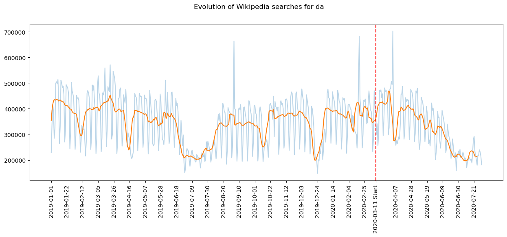
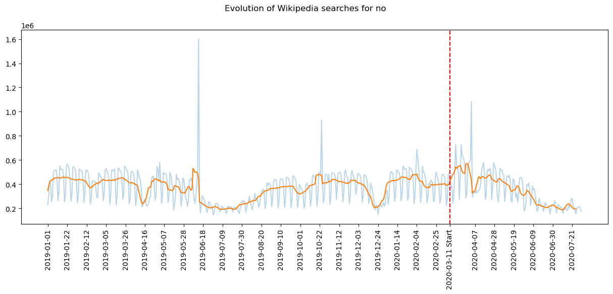
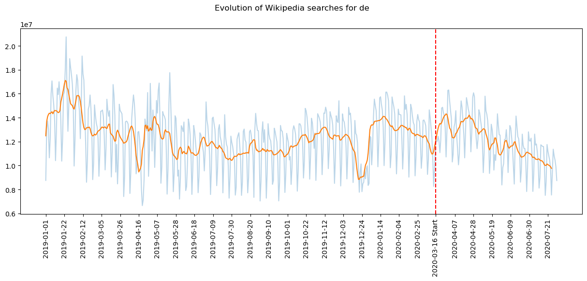
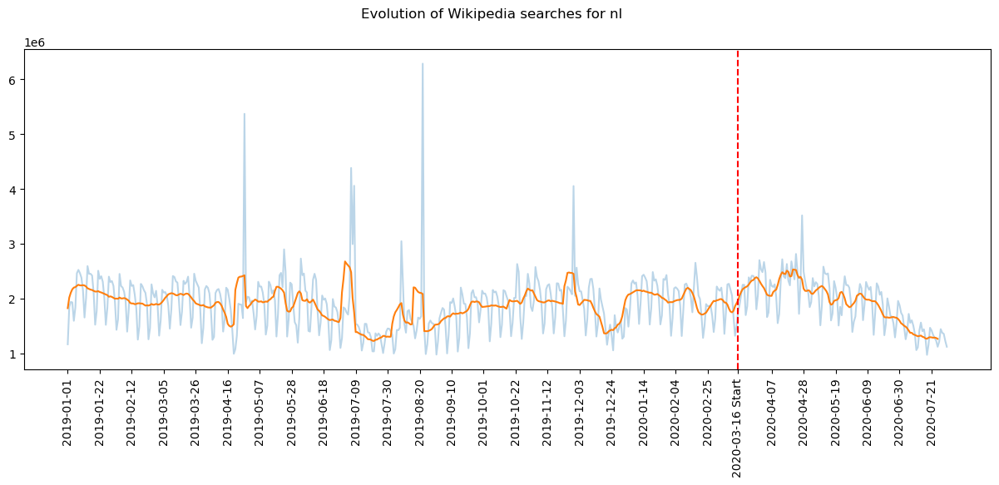
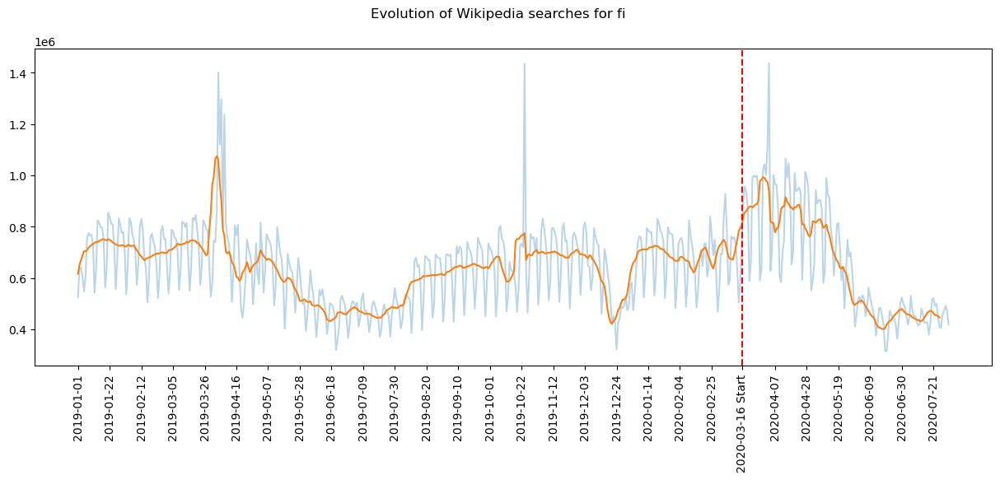
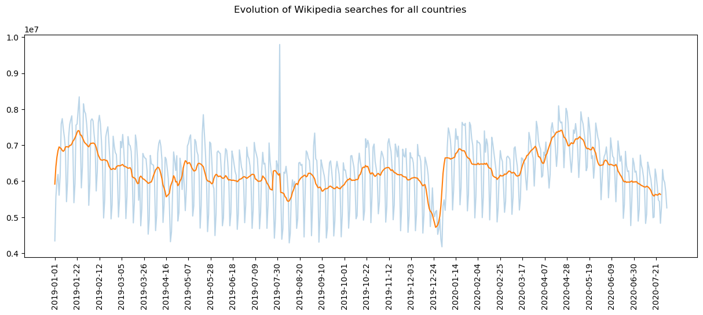

# Wiki dataset presentation


The objective of this section is to study the impact of the COVID-19 pandemic on the population's interests, taking into account both the democracy index of each country and the level of decline in mobility. To do this we had at our disposal the Coronawiki dataset which gives, for 64 subjects, the evolution of the number of daily visits for different versions of Wikipedia between 01 January 2018 and 31 July 2020. Here we will focus on only 12 countries which are Turkey, Serbia, Japan, Italy, South Korea, Catalonia, the Netherlands, Germany, Finland, Norway, Sweden and Denmark. These are the only versions of Wikipedia present in the dataset whose language can be directly associated with a single country. This was not the case for the English version of Wikipedia, for example, as English is spoken in many parts of the world.

We will start by plotting the evolution of the number of wikipedia searches for each of these countries, with the date of the start of the Mobility drastic stop for each of these countries, taken from the interventions csv. Finally we will plot the sum of them all by taking the population of each country as a weight in the mean calculation.

<html>
Plese select a country to display the details :
<label for="registration_select_country"></label>
<select id="registration_selection_country" name="registration_country">
    <option value = "select country" selected="selected_country"> ---Select--- </option>
    <option value = "Sweden">Sweden</option>
    <option value = "Denmark">Denmark</option>
    <option value = "Italy">Italy</option>
    <option value = "Norway">Norway</option>
    <option value = "Germany">Germany</option>
    <option value = "Japan">Japan</option>
    <option value = "Netherlands">Netherlands</option>
    <option value = "Finland">Finland</option>
    <option value = "Catalonia">Catalonia</option>
    <option value = "Turkey">Turkey</option>
    <option value = "Sum of all">Sum of all</option>
</select>

<section id = "show_Sweden" style="display: none;">
<p>
<h3><b>Sweden</b></h3>
<br>
<br>
<p align='center'>

</p>
</p>
</section>


<section id = "show_Denmark" style="display: none;">
<p>
<h3><b>Denmark</b></h3>
<br>
<br>
<p align='center'>

</p>
</p>
</section>


<section id = "show_Italy" style="display: none;">
<p>
<h3><b>Italy</b></h3>
<br>
<br>
<p align='center'>

</p>
</p>
</section>


<section id = "show_Norway" style="display: none;">
<p>
<h3><b>Norway</b></h3>
<br>
<br>
<p align='center'>

</p>
</p>
</section>


<section id = "show_Germany" style="display: none;">
<p>
<h3><b>Germany</b></h3>
<br>
<br>
<p align='center'>

</p>
</p>
</section>


<section id = "show_Japan" style="display: none;">
<p>
<h3><b>Japan</b></h3>
<br>
<br>
<p align='center'>

</p>
</p>
</section>


<section id = "show_Netherlands" style="display: none;">
<p>
<h3><b>The Netherlands</b></h3>
<br>
<br>
<p align='center'>

</p>
</p>
</section>


<section id = "show_Finland" style="display: none;">
<p>
<h3><b>Finland</b></h3>
<br>
<br>
<p align='center'>

</p>
</p>
</section>


<section id = "show_Catalonia" style="display: none;">
<p>
<h3><b>Catalonia</b></h3>
<br>
<br>
<p align='center'>

</p>
</p>
</section>


<section id = "show_Turkey" style="display: none;">
<p>
<h3><b>Turkey</b></h3>
<br>
<br>
<p align='center'>

</p>
</p>
</section>


<section id = "show_Sum_of_all" style="display: none;">
<p>
<h3><b>Sum of all</b></h3>
<br>
<br>
<p align='center'>

</p>
</p>
</section>

<br>
<br>

<script src='javascript_code_louis.js'></script>

</html>


The following figure shows the relative evolution of interest in each topic in the coronawiki dataset and in each country considered here. The relative evolution of interest for a given topic in a given country is defined as follows: 
**equation**
```math

\Delta = \frac{I_{covid} - I_{ref}}{I_{ref}}

```
where $I_{covid}$ is the average proportion of this topic among all wikipedia visits in this country during the covid period. $I_{ref}$ is the average proportion of this topic among all wikipedia visits in this country during same period but one year before (so in 2019)
On the vertical axis the matrix is sorted with the subject whose interest has globally decreased the most at the top and the subject whose interest has globally increased the most at the bottom. On the horizontal axis, countries are sorted according to their mobility shift, from highest on the left to lowest on the right. 
In the second image, only those topics that have a relative change in interest of more than 10% in absolute value (on average over all countries) are shown.

The subject in which interest decreased the most during the COVID was sport. 
This decline in interest in sport is almost uniform (approximately -20%) across the 12 countries considered, although they have different mobility shift values. Even in countries where mobility has decreased less, such as Finland or Sweden, and therefore where the practice of sport has probably remained more accessible than elsewhere, interest in sport has decreased significantly. There was also a decline in interest in other subjects such as architecture, the visual arts and transportation, which can be explained by the almost complete cessation of tourism and reduction of travel. Again, these decreased values do not seem to be correlated with either the democracy index or the mobility shift.

Among the 10 subjects that have gained the most interest overall among the population are video games, films, books, entertainment and internet culture. This can be explained quite easily by the fact that people have been looking for new occupations to occupy the large amount of free time spent at home. We also find 'biology' and 'medicine and health' which are probably linked to the public's concern and need for information about COVID-19. Here it seems interesting to look at the impact of the mobility shift on the relative evolution of interest in these topics. In the next figure each point represents a version of wikipedia, with the mobility shift in the associated country on the x-axis and the gain in interest in films and video games on the y-axis (weighted average of the two subjects). There appears to be a linear relationship between the two variables, the coefficients of which are made explicit in the graph. The slope of the line is about 0.6, which means that a 10-point decrease in mobility leads to a 6-point increase in interest in video games and films.

From an overall perspective, we can conclude that the populations of the countries studied appear to have complied with the containment and health measures imposed by governments. Indeed, people did not seek to take an interest in what was forbidden and inaccessible but rather in the only occupations that remained possible.


