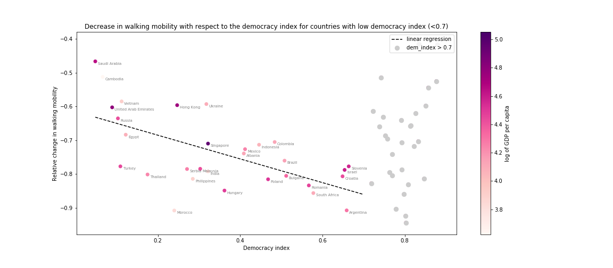
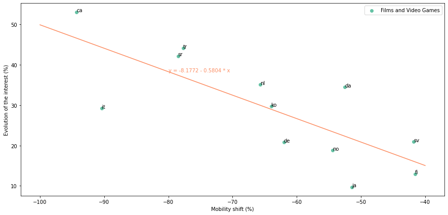

# Introduction

We studied the evolution of the behaviour of citizens who were subjected to mobility restriction measures due to the Covid-19 pandemic in spring 2020. More specifically, in the following data story, we will discuss the different levels of stringency of the measures put in place, looking at a possible link with the level of democracy of the countries. Then we will see that there may be a link between the level of stringency of the measures put in place and the evolution of people's interests.  
We will thus answer the following questions:  
**Did the most democratic countries implement the most moderate measures?**  
**Did citizens exposed to stricter measures think more about what they were not allowed to do?**  

To perform such analysis, we used three different types of data:  
-Democracy index records  
-Mobility data from Google and Apple  
-Pageviews data from different versions of Wikipedia  
 

# Presentation of the democracy index

Let’s start by exploring the democracy index around the world, in order to do this we have decided to use the liberal democracy from ‘Our world in Data’. Based on the expert assessments and index by V-Dem. It combines information on voting rights, the
freedom and fairness of elections, freedoms of association and expression, civil liberties, and executive constraints. It ranges from 0 to 1 (most democratic), and gives data with a variable time span from 1789 until 2021.

We can see on the graph below the evolution of these democracy indexes since the year 1960. We can spot some very marking period in some countries history and how that reflected on the evolution of their liberal democracy. We can mention, the 1980 Turkish coup d'état followed buy the partial return to democracy in 1983. The death of caudillo Francisco Franco in 1075 marking the beginning if the Spanish transition to democracy the establishment of the parliamentary monarchy and the subsequent accession of King Juan Carlos I to the throne...

The vertical line marks the year 2019, the year where we consoider the data for the rest of our study.

Next using the geopandas documentation, we plotted the democracy index for the year 2019, we display here the world map, with a certain zoom to the region that interest us for the remaining of the study. 

# Mobility data

The covid pandemics impacted our mobility in an unprecedented way. In a vast majority of countries in the world, people almost stopped going outside and spent the majority of their time at home, because they were forced to, because of the fear of the virus, because of the closure of the shops or because of a combination of these factors. Of course, not all countries reacted in the same way to the pandemics. Some countries showed only a small decrease in the mobility of the inhabitants while some others completely stopped all social activity. Three countries were taken as examples in the graph below :

France and Mexico show a sharp decrease in walking mobility, which reaches a very low level in France. On the contrary in Vietnam, the mobility decreases much more slowly, and, then stays at a higher level than in the two other countries.

The response of the authorities were however similar in these countries, with the suspension on non essential activities, interdiction of meetings etc… However, they have probably been applied in a more or less strict way, and the response of the population to these measures has probably been different, leading to very different evolutions of mobilities.

The mobility change can also be studied more precisely, taking into account the different categories of places that people visited. In this section we focus more precisely on the categories “retail and recreation”, “grocery and pharmacy”, “transit stations” and “workplaces” which are extracted from the Google mobility data. The drop in each of these categories can be evaluated by by taking the difference between the two “lowest” weeks (which corresponds to the peak of the covid pandemics in the concerned country) and the two “highest” weeks (before the pandemics). By doing this, the response to the pandemics from each country can be characterized by the drop in the visits to the different categories of places in the corresponding country.

The different countries can then be clusterized with k-means to group countries with a similar response to pandemics. The results of this clustering is detailed below : (à remplacer ensuite par une sorte de graphe interactif)

<html>
Plese select a cluster to display the details :
<label for="registration_select"></label>
<select id="registration_selection" name="registration">
    <option value = "select cluster" selected="selected"> ---Select--- </option>
    <option value = "option1">Cluster 1</option>
    <option value = "option2">Cluster 2</option>
    <option value = "option3">Cluster 3</option>
    <option value = "option4">Cluster 4</option>
    <option value = "option5">Cluster 5</option>
</select>

<section id = "show_option1" style="display: none;">

<h3><b>Cluster 1</b></h3>

<b>Countries :</b>  

United Arab Emirates , Austria, Bosnia and Herzegovina, Bangladesh, Belgium, Chile, Costa Rica, Cape Verde, Dominican Republic, Egypt, France, United Kingdom, Ghana, Greece, Guatemala, Croatia, Ireland, Israel, Iraq, Italy, Kazakhstan, Lebanon, Luxembourg, Moldova, North Macedonia, Malta, Malaysia, Namibia, Poland, Portugal, Paraguay, Romania, Russia, Rwanda, Saudi Arabia, Slovenia, Slovakia, Turkey, Trinidad and Tobago, Ukraine, Uganda, Venezuela, Zimbabwe

 
 

<b>Democracy index distribution :</b>

<b>Centroid of the cluster :</b>
<ul>
<li>retail and recreation : -74.2 %</li>
<li>grocery and pharmacy : -49.7 %</li>
<li>transit stations : -74.1 %</li>
<li>workplaces : -62.7 %</li>
</ul>

<b>Analysis : </b>This cluster contains a high number of countries. It seems to be the most popular restrictions genotype over the world, with an important decrease in the visits to “retail and recreation” places and transit stations. This decrease was less important for vital shops (“grocery and pharmacy”). An important part of democratic countries (democracy index > 0.6) have followed this path. The other part is mostly in the cluster 4.

</section>

<section id = "show_option2" style="display: none;">

<h3><b>Cluster 2</b></h3>

<b>Countries : </b>  
Burkina Faso, Bahrain, Benin, Belarus, Cameroon, Haiti, Japan, Cambodia, Latvia, Mali, Mozambique, Niger, Papua New Guinea, Sweden, Senegal, Togo, Thailand, Tanzania, Yemen, Zambia

 
 

<b>Democracy index distribution :</b>

<b>Centroid of the cluster : </b>
<ul>
<li>Retail and recreation : -34.0 % </li>
<li>Grocery and Pharmacy : -21.0 %</li>
<li>Transit stations : -40.9 %</li>
<li>Workplaces : -32.4 %</li>
</ul>

<b>Analysis : </b>Cluster with light restrictions. Mostly composed of undemocratic countries. This is quite surprising as we could expect undemocratic countries to impose the hardest restrictions while the contrary seems to happen.

</section>

<section id = "show_option3" style="display: none;">

<h3><b>Cluster 3</b></h3>

<b>Countries :</b>   
Argentina, Barbados, Bolivia, Botswana, Colombia, Ecuador, Spain, Georgia, Honduras, India, Jordan, Kyrgyzstan, Kuwait, Sri Lanka, Morocco, Mauritius, Nepal, New Zealand, Panama, Peru, Philippines, Pakistan, Serbia, El Salvador, South Africa

 
 

<b>Democracy index distribution :</b>

<b>Centroid of the cluster : </b>
<ul>
<li>Retail and recreation : -85.2 %</li>
<li>Grocery and pharmacy : -69.6 %</li>
<li>Transit stations : -82.9 %</li>
<li>Workplaces : -78.6 %</li>
</ul>

<b>Analysis : </b>Hardest lockdown. What is remarkable here is that the countries with the hardest restrictions on people’s mobility are almost exclusively countries with a moderate democracy index. One probable explanation is that it was impossible on democratic countries to go as far in the restrictions without violating the rule of law. As undemocratic countries are often quite poor, it is probably impossible for them to impose such severe restrictions without durably impacting an already fragile economy.

</section>

<section id = "show_option4" style="display: none;">

<h3><b>Cluster 4</b></h3>

<b>Countries : </b>  

Afghanistan, Angola, Australia, Bulgaria, Brazil, Canada, Switzerland, Czechia, Germany, Denmark, Estonia, Finland, Fiji, Gabon, Hungary, Indonesia, Jamaica, Kenya, Laos, Lithuania, Libya, Mexico, Nigeria, Nicaragua, Netherlands, Norway, Oman, Qatar, Singapore, Tajikistan, United States, Uruguay, Vietnam

 
 

<b>Democracy index distribution :</b>

<b>Centroid of the cluster : </b>
<ul>
<li>Retail and recreation : -57.4 %</li>
<li>Grocery and pharmacy : -34.4 %</li>
<li>Transit stations : -60.6 %</li>
<li>Workplaces : -51.4 %</li>
</ul>

<b>Analysis :</b> Cluster with moderate restrictions. A majority of the democratic countries is contained in this cluster. This is the more balanced cluster, with a moderate decrease in the visits to “retail and recreation” places and “transit stations”, and a light decrease in the visits to vital shops. The impact on work is also moderate.

</section>

<section id = "show_option5" style="display: none;">

<h3><b>Cluster 5</b></h3>

<b>Countries : </b>  
Hong Kong, South Korea, Mongolia, Taiwan

 
 

<b>Democracy index distribution:</b>

<b>Centroid of the cluster :</b>
<ul>
<li>Retail and recreation -12.7 %</li>
<li>Grocery and Pharmacy : -4.5 %</li>
<li>Transit stations : -11.3 %</li>
<li>Workplaces : -16.9 %</li>
</ul>

<b>Analysis :</b> Cluster with almost no restrictions. It is difficult to interpret on the democracy index as there are very few countries in this cluster.

</section>

 
 

</html>

# Correlations democracy index x mobility drop

As shown in the previous clustering, the democracy index seems to have an impact on the response of a country to the pandemics. Let us investigate more on this possible link. Using the data coming from the Apple mobility report, one can plot the decrease in walking mobility with respect to the democracy index, each point representing a country. The drop in walking mobility is evaluated as the two highest weeks before lockdown vs. the two lowest weeks (i.e. the peak of the restrictions).

<html>

  

</html>

A decreasing trend can clearly be observed for countries with a democracy index lower to 0.7. Let us take into account only these countries, and study the relation between walking mobility change and democracy index using a linear regression. <button id="button_plot" onclick="function_button_plot()">Click me to display linear regression</button>

<html>

  

</html>

The R-squared value being 0.385 , the democracy index explains an important part of the variance observed in the walking mobility change, for countries with a relatively low democracy index. The coefficients indicate that in the range of democracy index [0, 0.7], the walking mobility decreases by 3.5% each time the democracy index is increased by 0.1. There is thus a clear link between democracy index and the strength of the restrictions, but this link is much less obvious when the democratic countries are also considered. 

One possible explanation of this phenomena could be the association between the democracy index and the wealth of the countries. The more democratic, the richest a country is and the higher is its capacity to enforce constraining measures without too important impact on the poverty of its population.

[ADD PIB DEMOCRARY INDEX GRAPH]

Conclusion (à reformuler): the democracy index is not what drives the response to the pandemics, but the wealth of the country. Undemocratic country cannot inforce high restrictions without increasing poverty which could compromise their regime.
Very democratic countries are also the richests : they have all lattitude to impose the measures they want as they are rich enough. Maybe also better medical infrastructure which necessitate less restrictions
+ Younger population in poorer countries

# Wiki dataset presentation

The objective of this section is to study the impact of the COVID-19 pandemic on the population's interests, taking into account the different level of mobility shift in each country. Only 12 countries are considered here, which are Turkey, Serbia, Japan, Italy, South Korea, Catalonia, the Netherlands, Germany, Finland, Norway, Sweden and Denmark. These are the only versions of Wikipedia present in the dataset whose language can be directly associated with a single country. This was not the case for the English version of Wikipedia, for example, as English is spoken in many parts of the world.

Using the following drop-down menu it is possible to vizualise the total evolution of the number of wikipedia searches for these countries. On the time scale the date of the drastic drop in mobility and the date of return to normalcy are depicted. This period will be considered as the 'COVID' period for the rest of the analysis. The overall evolution in all countries is also available, the population of each country is taken as a weight in the mean calculation.

<html>
Plese select a country to display the details :
<label for="registration_select_country"></label>
<select id="registration_selection_country" name="registration_country">
    <option value = "select country" selected="selected_country"> ---Select--- </option>
    <option value = "Sweden">Sweden</option>
    <option value = "Denmark">Denmark</option>
    <option value = "Italy">Italy</option>
    <option value = "Norway">Norway</option>
    <option value = "Germany">Germany</option>
    <option value = "Japan">Japan</option>
    <option value = "Netherlands">Netherlands</option>
    <option value = "Finland">Finland</option>
    <option value = "Catalonia">Catalonia</option>
    <option value = "Turkey">Turkey</option>
    <option value = "Sum of all">Sum of all</option>
</select>

<section id = "show_Sweden" style="display: none;">

<h3><b>Sweden</b></h3>
 
 

</section>

<section id = "show_Denmark" style="display: none;">

<h3><b>Denmark</b></h3>
 
 

</section>

<section id = "show_Italy" style="display: none;">

<h3><b>Italy</b></h3>
 
 

</section>

<section id = "show_Norway" style="display: none;">

<h3><b>Norway</b></h3>
 
 

</section>

<section id = "show_Germany" style="display: none;">

<h3><b>Germany</b></h3>
 
 

</section>

<section id = "show_Japan" style="display: none;">

<h3><b>Japan</b></h3>
 
 

</section>

<section id = "show_Netherlands" style="display: none;">

<h3><b>The Netherlands</b></h3>
 
 

</section>

<section id = "show_Finland" style="display: none;">

<h3><b>Finland</b></h3>
 
 

</section>

<section id = "show_Catalonia" style="display: none;">

<h3><b>Catalonia</b></h3>
 
 

</section>

<section id = "show_Turkey" style="display: none;">

<h3><b>Turkey</b></h3>
 
 

</section>

<section id = "show_Sum_of_all" style="display: none;">

<h3><b>Sum of all</b></h3>
 
 

</section>

 
 

</html>

Now the idea is to visualize in a simple and clear way which subjects have emerged or on the contrary declined during the pandemic according to the countries. The following figure shows the relative evolution of interest in several topics and in each country considered here. The relative evolution of interest for a given topic in a given country is defined as follows: 

<html>
<head>
  
</head>

`\Delta = \frac{I_{covid} - I_{ref}}{I_{ref}} \newline`

`I_{covid}` : average proportion of this topic among all wikipedia visits in this country during the covid period `\newline`

`I_{ref}` : average proportion of this topic among all wikipedia visits in this country during same period but one year before (so in 2019)

</html>

On the vertical axis the matrix is sorted with the subject whose interest has globally decreased the most at the top and the subject whose interest has globally increased the most at the bottom. On the horizontal axis, countries are sorted according to their mobility shift, from highest on the left to lowest on the right. 
Moreover, only those topics that have a relative change in interest of more than 10% in absolute value (on average over all countries) are shown.

The subject in which interest decreased the most during the COVID was sport. 
This decline in interest in sport is almost uniform (approximately -20%) across the 12 countries considered, although they have different mobility shift values. Even in countries where mobility has decreased less, such as Finland or Sweden, interest in sport has decreased significantly. There was also a decline in interest in other subjects such as architecture, visual arts and transportation, which can be explained by the almost complete cessation of tourism and reduction of travel. Again, these decreased values do not seem to be correlated with either the democracy index or the mobility shift.

Among the 10 subjects that have gained the most interest overall among the population are video games, films, books, entertainment and internet culture. This can be explained quite easily by the fact that people have been looking for new occupations to occupy the large amount of free time spent at home. 'biology' and 'medicine and health' have also gained a lot of interest, this is probably linked to the public's concern and need for information about COVID-19. Here the color gradient seems to indicate a relationship between the level of decline in mobility and the gain in interest for certain subjects, which can checked with the next figure.

Each point of the next figure represents a version of wikipedia, with the mobility shift in the associated country on the x-axis and the gain in interest in films and video games on the y-axis (weighted average of the two subjects). 

There appears to be a linear relationship between the two variables, the coefficients of which are made explicit in the graph. The slope of the line is about 0.6, which means that a 10-point decrease in mobility leads to a 6-point increase in interest in video games and films.

From an overall perspective, it is possible to conclude that the populations of the countries studied appear to have complied with the containment and health measures imposed by governments. Indeed, people did not seek to take an interest in what was forbidden and inaccessible but rather in the only occupations that remained possible. This analysis goes in the direction of a capacity of the population to adapt to the situation and seems to indicate that the extremist protest movements were perhaps over-represented on the social networks or in the media compared to their real extent in the society.

